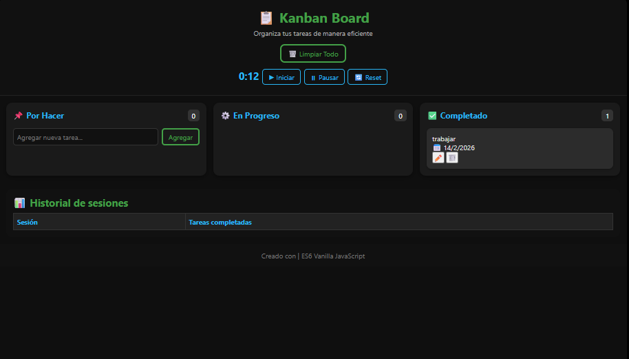

# 📋 Kanban Board – Gestor de Tareas con Pomodoro ⏱️

Aplicación web desarrollada en **JavaScript ES6 Vanilla** para organizar tareas de manera visual y eficiente, con un tablero estilo **Kanban** y un sistema de **Pomodoro Timer** integrado para medir sesiones de trabajo y registrar productividad.

---

## 🚀 Características principales

- **Tablero Kanban** con tres columnas:
  - 📌 **Por Hacer**
  - ⚙️ **En Progreso**
  - ✅ **Completado**

- **Gestión de tareas**:
  - Crear, mover y eliminar tarjetas.
  - Drag & Drop intuitivo.
  - Contadores automáticos por columna.

- **Persistencia local**:
  - Todo se guarda en el navegador con `localStorage`.
  - No requiere servidor ni base de datos.

- **Pomodoro Timer**:
  - Cronómetro de 25 minutos por sesión.
  - Botones de iniciar, pausar y reset.
  - Al finalizar cada sesión se registra un **historial** con las tareas completadas.

- **Diseño moderno y responsive**:
  - Paleta oscura con acentos verdes/azules.
  - Botones transparentes con hover llamativo.
  - Adaptable a móviles y diferentes tamaños de ventana.

---

## 📸 Capturas de ejemplo



---

## 🛠️ Tecnologías utilizadas

- **HTML5** – estructura semántica.
- **CSS3 (Flexbox + Media Queries)** – diseño responsive y moderno.
- **JavaScript ES6** – lógica de tareas, drag & drop, persistencia y Pomodoro.
- **LocalStorage** – almacenamiento en cliente.

---

## 📈 Próximas mejoras

- 🔐 Autenticación de usuarios (login).
- 🗄️ Guardado en base de datos (MongoDB/MySQL).
- 🌐 Multiusuario con acceso desde cualquier dispositivo.
- 📊 Estadísticas avanzadas de productividad.

---

## 📦 Instalación y uso

1. Clona el repositorio:

   ```bash
   git clone https://github.com/LechuDev/kanban-board.git
   ```

2. Abre el proyecto en **VS Code**.
3. Usa la extensión **Live Server** (Go Live) para correrlo en tu navegador.
4. ¡Listo! Empieza a organizar tus tareas y medir tu productividad.

---

## 👨‍💻 Autor

Creado con ❤️ por **LechuDev (Jorge A. Fuentes)**  
Portafolio: [lechudev.github.io/Porfolio](https://lechudev.github.io/Porfolio)
